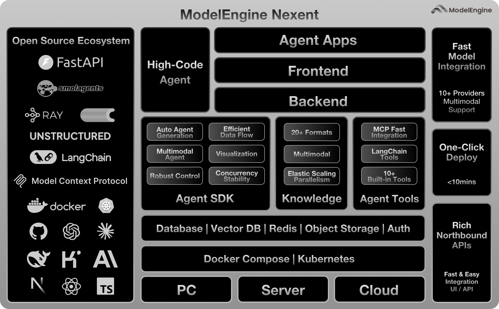

[](https://nexent.tech)
[](README.md)
[](README_CN.md)
[](https://modelengine-group.github.io/nexent)
[](https://hub.docker.com/repositories/nexent)
[](https://codecov.io/gh/ModelEngine-Group/nexent)

Nexent is a zero-code platform for auto-generating agents — no orchestration, no complex drag-and-drop required, using pure language to develop any agent you want. Built on the MCP ecosystem with rich tool integration, Nexent also provides various built-in agents to meet your intelligent service needs in different scenarios such as work, travel, and daily life. Nexent offers powerful capabilities for agent running control, multi-agent collaboration, data processing and knowledge tracing, multimodal dialogue, and batch scaling.

> One prompt. Endless reach.

### 🌐 Visit our [official website](https://nexent.tech/)



https://github.com/user-attachments/assets/db6b7f5a-9ee8-4327-ae6f-c5af896126b4

# ⚡ Have a try first

### 📋 Prerequisites  

| Resource | Minimum |
|----------|---------|
| **CPU**  | 2 cores |
| **RAM**  | 6 GiB   |
| **Software** | Docker & Docker Compose installed |

### 🛠️ Quick start with Docker Compose

```bash
git clone https://github.com/ModelEngine-Group/nexent.git
cd nexent/docker
cp .env.example .env # fill only necessary configs
bash deploy.sh
```

When the containers are running, open **http://localhost:3000** in your browser and follow the setup wizard.

# 🤝 Join Our Community

> *If you want to go fast, go alone; if you want to go far, go together.*

We have released **Nexent v1**, and the platform is now relatively stable. However, there may still be some bugs, and we are continuously improving and adding new features. Stay tuned: we will announce **v2.0** soon!

* **🗺️ Check our [Feature Map](https://github.com/orgs/ModelEngine-Group/projects/6)** to explore current and upcoming features.
* **🔍 Try the current build** and leave ideas or bugs in the [Issues](https://github.com/ModelEngine-Group/nexent/issues) tab.
* **🐛 Check our [Known Issues page](https://github.com/orgs/ModelEngine-Group/projects/9)** for the latest issue status and solutions.

> *Rome wasn't built in a day.*

If our vision speaks to you, jump in via the **[Contribution Guide](https://modelengine-group.github.io/nexent/en/contributing)** and shape Nexent with us.

Early contributors won't go unnoticed: from special badges and swag to other tangible rewards, we're committed to thanking the pioneers who help bring Nexent to life.

Most of all, we need visibility. Star ⭐ and watch the repo, share it with friends, and help more developers discover Nexent — your click brings new hands to the project and keeps the momentum growing.

## 💬 Community & contact

- Browse the [Documentation](https://modelengine-group.github.io/nexent) for more information.  
- Join our [Discord community](https://discord.gg/tb5H3S3wyv) to chat with other developers and get help!
- Conntact us by Wechat, find our QR Code in our [website](https://nexent.tech/en/contact)

# ✨ Key Features

`1` **Smart agent prompt generation**  
   Turn plain language into runnable prompts. Nexent automatically chooses the right tools and plans the best action path for every request.

   

`2` **Scalable data process engine**  
   Process 20+ data formats with fast OCR and table structure extraction, scaling smoothly from a single process to large-batch pipelines.

   

`3` **Personal-grade knowledge base**  
   Import files in real time, auto-summarise them, and let agents access both personal and global knowledge instantly, also knowing what it can get from each knowledge base.

   

`4` **Internet knowledge search**  
   Connect to 5+ web search providers so agents can mix fresh internet facts with your private data.

   

`5` **Knowledge-level traceability**  
   Serve answers with precise citations from web and knowledge-base sources, making every fact verifiable.

   

`6` **Multimodal understanding & dialogue**  
   Speak, type, files, or show images. Nexent understands voice, text, and pictures, and can even generate new images on demand.

   

`7` **MCP tool ecosystem**  
   Drop in or build Python plug-ins that follow the MCP spec; swap models, tools, and chains without touching core code.

   

# 🌱 MCP Tool Ecosystem

Check our [MCP Ecosystem page](https://modelengine-group.github.io/nexent/en/mcp-ecosystem/overview.html) for detailed information about the MCP tool ecosystem, including community hubs, recommended tools, and integration guides.

# 🛠️ Developer Guide

### 🤖 Model Configuration & Provider Recommendations

Check our [Model Providers page](https://modelengine-group.github.io/nexent/en/getting-started/model-providers.html) for detailed model configuration guides and recommended provider information.

### 🔧 Hack on Nexent

Want to build from source or add new features? Check the [Contribution Guide](https://modelengine-group.github.io/nexent/en/contributing) for step-by-step instructions.

### 🛠️ Build from Source

Prefer to run Nexent from source code? Follow our [Developer Guide](https://modelengine-group.github.io/nexent/en/getting-started/development-guide) for detailed setup instructions and customization options.

# 📄 License

Nexent is licensed under the [MIT](LICENSE) with additional conditions. Please read the [LICENSE](LICENSE) file for details.

