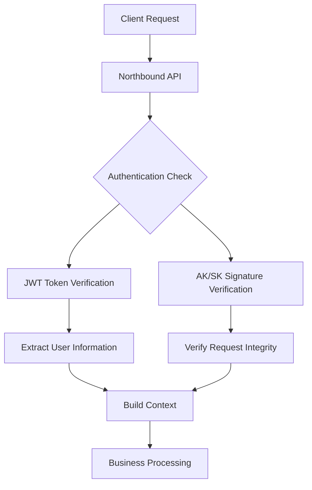
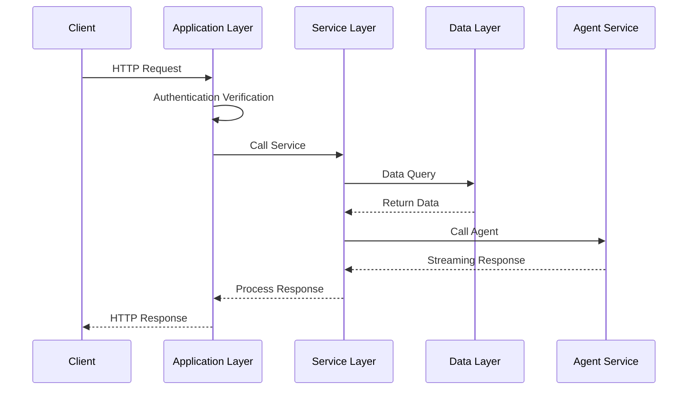
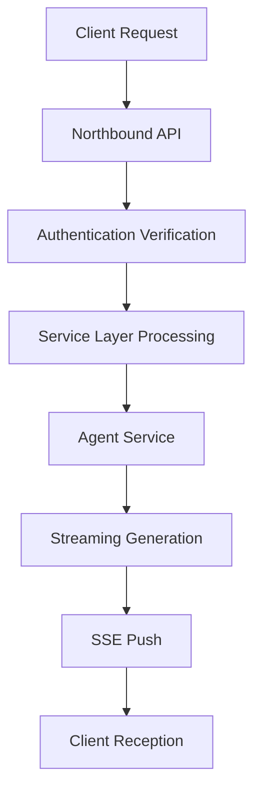
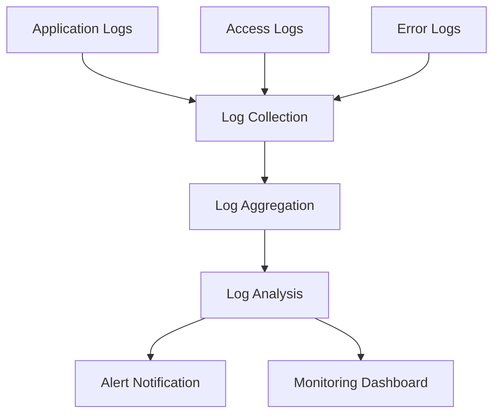

# Northbound API Architecture Guide

## System Architecture Overview

The Northbound API adopts a layered architecture design, providing secure, reliable, and high-performance API services.

## Architecture Components

### 1. Application Layer (App Layer)

**File Location**: `backend/apps/northbound_app.py`, `backend/apps/northbound_base_app.py`

**Responsibilities**:
- HTTP request processing and response
- Request parameter validation
- Authentication and authorization
- Exception handling and status code mapping
- Cross-Origin Resource Sharing (CORS) support

**Core Functions**:
```python
# Request processing flow
@router.post("/chat/run")
async def run_chat(request: Request, ...):
    # 1. Parse northbound context (authentication)
    ctx = await _parse_northbound_context(request)
    
    # 2. Call service layer
    return await start_streaming_chat(ctx, ...)
    
    # 3. Exception handling
    except UnauthorizedError as e:
        raise HTTPException(status_code=401, detail=str(e))
```

### 2. Service Layer (Service Layer)

**File Location**: `backend/services/northbound_service.py`

**Responsibilities**:
- Core business logic implementation
- Data transformation and mapping
- External system integration
- Idempotency control
- Rate limiting

**Core Functions**:
```python
# Business logic processing
async def start_streaming_chat(ctx, external_conversation_id, agent_name, query):
    # 1. Rate limiting check
    await check_and_consume_rate_limit(ctx.tenant_id)
    
    # 2. ID mapping conversion
    internal_id = await to_internal_conversation_id(external_conversation_id)
    
    # 3. Idempotency control
    await idempotency_start(composed_key)
    
    # 4. Call agent service
    return await run_agent_stream(agent_request, ...)
```

### 3. Data Layer (Data Layer)

**Responsibilities**:
- Database operations
- ID mapping management
- Session data storage
- Agent information queries

**Core Components**:
- `database/conversation_db.py`: Conversation data management
- `database/partner_db.py`: Partner data management
- `database/agent_db.py`: Agent data management

## Authentication Architecture

### Dual Authentication System



### Authentication Flow

1. **JWT Token Verification**
   - Verify Token validity
   - Extract `user_id` and `tenant_id`
   - Check user permissions

2. **AK/SK Signature Verification**
   - Verify request signature
   - Check timestamp validity
   - Prevent replay attacks

## Data Flow Architecture

### Request Processing Flow



### Streaming Response Architecture



## Security Architecture

### Security Protection Layers

1. **Network Layer Security**
   - HTTPS encrypted transmission
   - Firewall rules
   - DDoS protection

2. **Application Layer Security**
   - Dual authentication mechanism
   - Request signature verification
   - Rate limiting

3. **Data Layer Security**
   - Encrypted data storage
   - Access permission control
   - Audit logs

### Security Features

- **Request Signature**: HMAC-SHA256 signature prevents tampering
- **Timestamp Verification**: Prevents replay attacks
- **Rate Limiting**: Prevents abuse and attacks
- **Idempotency Control**: Prevents duplicate operations
- **Audit Logs**: Complete operation records

## Performance Architecture

### Performance Optimization Strategies

1. **Connection Pool Management**
   - HTTP connection reuse
   - Asynchronous processing
   - Connection timeout control

2. **Caching Strategy**
   - Agent information caching
   - Session data caching
   - Response result caching

3. **Streaming Processing**
   - Server-Sent Events (SSE)
   - Real-time data push
   - Memory optimization

### Performance Metrics

- **Response Time**: < 100ms (non-streaming interfaces)
- **Throughput**: 1000+ QPS
- **Concurrent Connections**: 10000+ concurrent
- **Streaming Latency**: < 50ms

## Monitoring Architecture

### Monitoring System

1. **Application Monitoring**
   - Request volume and response time
   - Error rate and exceptions
   - Resource usage

2. **Business Monitoring**
   - Agent call statistics
   - Session creation and activity
   - User behavior analysis

3. **Infrastructure Monitoring**
   - Server performance
   - Database performance
   - Network conditions

### Logging Architecture



## Deployment Architecture

### Deployment Modes

1. **Single Machine Deployment**
   - Suitable for development and testing
   - Lower resource requirements
   - Simple configuration

2. **Cluster Deployment**
   - Suitable for production environment
   - High availability
   - Load balancing

3. **Containerized Deployment**
   - Docker containers
   - Kubernetes orchestration
   - Elastic scaling

### Environment Configuration

```yaml
# docker-compose.yml example
version: '3.8'
services:
  northbound-api:
    image: nexent/northbound-api:latest
    ports:
      - "5013:5013"
    environment:
      - JWT_SECRET=your_jwt_secret
      - DATABASE_URL=postgresql://...
    depends_on:
      - postgres
      - redis
```

## Scaling Architecture

### Horizontal Scaling

1. **Load Balancing**
   - Multi-instance deployment
   - Request distribution
   - Health checks

2. **Database Scaling**
   - Read-write separation
   - Database sharding
   - Cache layer

3. **Service Scaling**
   - Microservice splitting
   - Service mesh
   - API gateway

### Feature Extension

1. **New Interface Addition**
   - Follow existing patterns
   - Unified authentication mechanism
   - Complete documentation updates

2. **Feature Enhancement**
   - Backward compatibility
   - Progressive upgrades
   - Smooth migration

## Best Practices

### Development Best Practices

1. **Code Standards**
   - Follow layered architecture
   - Unified exception handling
   - Complete unit tests

2. **Security Best Practices**
   - Input validation
   - Output encoding
   - Principle of least privilege

3. **Performance Best Practices**
   - Asynchronous processing
   - Connection pool management
   - Caching strategies

### Operations Best Practices

1. **Monitoring and Alerting**
   - Key metrics monitoring
   - Exception alerts
   - Performance analysis

2. **Log Management**
   - Structured logging
   - Log rotation
   - Sensitive information masking

3. **Backup and Recovery**
   - Data backup
   - Configuration backup
   - Disaster recovery

---

*Architecture Guide - Deep dive into Northbound API technical implementation*
