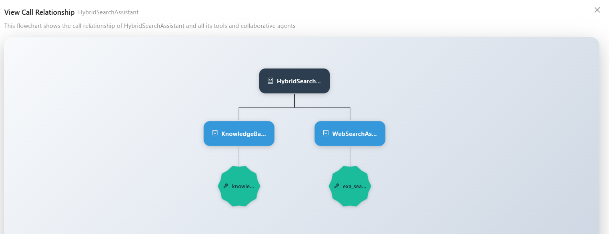

# Agent Development

In the Agent Development page, you can create, configure, and manage agents. Agents are the core feature of Nexent—they can understand your needs and perform corresponding tasks.

## 🔧 Create an Agent

On the Agent Management tab, click "Create Agent" to create a new blank agent. Click "Exit Create" to leave creation mode.
If you have an existing agent configuration, you can also import it:

1. Click "Import Agent"
2. In the file selection dialog, select the agent configuration file (JSON format)
3. Click "Open"; the system will validate the file format and content, and display the imported agent information

  

## 👥 Configure Collaborative Agents/Tools

You can configure other collaborative agents for your created agent, as well as assign available tools to empower the agent to complete complex tasks.

### 🤝 Collaborative Agents

1. Click the plus sign under the "Collaborative Agent" tab to open the selectable agent list
2. Select the agents you want to add from the dropdown list
3. Multiple collaborative agents can be selected
4. Click × to remove an agent from the selection

  

### 🛠️ Select Agent Tools

Agents can use various tools to complete tasks, such as knowledge base search, email sending, file management, and other local tools. They can also integrate third-party MCP tools or custom tools.

1. On the "Select Tools" tab, click "Refresh Tools" to update the available tool list
2. Select the group containing the tool you want to add
3. View all available tools under the group; click ⚙️ to view tool details and configure parameters
4. Click the tool name to select/deselect it
   - If the tool has required parameters that are not configured, a popup will appear to guide you through parameter configuration
   - If all required parameters are already configured, the tool will be selected directly

  

> 💡 **Tips**：
> 1. Please select the `knowledge_base_search` tool to enable the knowledge base search function.
> 2. Please select the `analyze_text_file` tool to enable the parsing function for document and text files.
> 3. Please select the `analyze_image` tool to enable the parsing function for image files.
> 
> 📚 Want to learn about all the built-in local tools available in the system? Please refer to [Local Tools Overview](./local-tools/index.md).

### 🔌 Add MCP Tools

Nexent allows you to quickly and easily use third-party MCP tools to enrich agent capabilities.

1. On the "Select Agent Tools" tab, click "MCP Config" to configure MCP servers in the popup and view configured servers
2. Enter the server name and URL (currently only SSE protocol is supported)
   - ⚠️ **Note:** The server name must contain only English letters or digits; spaces, underscores, and other characters are not allowed.
3. Click "Add" to complete the addition

  

Many third-party services such as [ModelScope](https://www.modelscope.cn/mcp) provide MCP services, which you can quickly integrate and use.
You can also develop your own MCP services and connect them to Nexent; see [MCP Server Development](../mcp-ecosystem/mcp-server-development.md).

### ⚙️ Custom Tools

You can refer to the following guides to develop your own tools and integrate them into Nexent to enrich agent capabilities:

- [LangChain Tools Guide](../backend/tools/langchain)
- [MCP Tool Development](../backend/tools/mcp)
- [SDK Tool Documentation](../sdk/core/tools)

### 🧪 Tool Testing

Nexent provides a "Tool Testing" capability for all types of tools—whether they are built-in tools, externally integrated MCP tools, or custom-developed tools. If you are unsure about a tool's effectiveness when creating an agent, you can use the testing feature to verify that the tool works as expected.

1. Click the gear icon ⚙️ next to the tool to open the tool's detailed configuration popup
2. First, ensure that all required parameters (marked with red asterisks) are configured
3. Click the "Test Tool" button in the lower left corner of the popup
4. A new test panel will appear on the right side
5. Enter the tool's input parameters in the test panel. For example:
   - When testing the local knowledge base search tool `knowledge_base_search`, you need to enter:
     - The test `query`, such as "benefits of vitamin C"
     - The search `search_mode` (default is `hybrid`)
     - The target index list `index_names`, such as `["Medical", "Vitamin Encyclopedia"]`
     - If `index_names` is not entered, it will default to searching all knowledge bases selected on the knowledge base page
6. After entering the parameters, click "Execute Test" to start the test and view the test results below

  

## 📝 Describe Business Logic

### ✍️ Describe How the Agent Should Work

Based on the selected collaborative agents and tools, you can now describe in simple language how you expect this agent to work. Nexent will automatically generate the agent name, description, and prompts based on your configuration and description.

1. In the editor under "Describe how should this agent work", enter a brief description, such as "You are a professional knowledge Q&A assistant with local knowledge search and online search capabilities, synthesizing information to answer user questions"
2. Click the "Generate" button, and Nexent will generate detailed agent content for you, including basic information and prompts (role, usage requirements, few shots)
3. You can edit and fine-tune the auto-generated content (especially the prompts) in the Agent Detail Content below

  

### 🐛 Debug and Save

After completing the initial agent configuration, you can debug the agent and fine-tune the prompts based on the debugging results to continuously improve agent performance.

1. Click the "Debug" button in the lower right corner of the page to open the agent debug page
2. Test conversations with the agent and observe its responses and behavior
3. Review conversation performance and error messages, and optimize the agent prompts based on the test results

After successful debugging, click the "Save" button in the lower right corner, and the agent will be saved and appear in the agent list.

## 📋 Manage Agents

In the agent list on the left, you can perform the following operations on existing agents:

### 🔗 View Call Relationships

View the collaborative agents/tools used by the agent, displayed in a tree diagram to clearly see the agent call relationships.

  

### 📤 Export

Export successfully debugged agents as JSON configuration files. You can use this JSON file to create a copy by importing it when creating an agent.

### 🗑️ Delete

Delete an agent (this cannot be undone, please proceed with caution).

## 🚀 Next Steps

After completing agent development, you can:

1. View and manage all agents in **[Agent Space](./agent-space)**
2. Interact with agents in **[Start Chat](./start-chat)**
3. Configure **[Memory Management](./memory-management)** to enhance the agent's personalization capabilities

If you encounter any issues during agent development, please refer to our **[FAQ](../getting-started/faq)** or ask for support in [GitHub Discussions](https://github.com/ModelEngine-Group/nexent/discussions).
