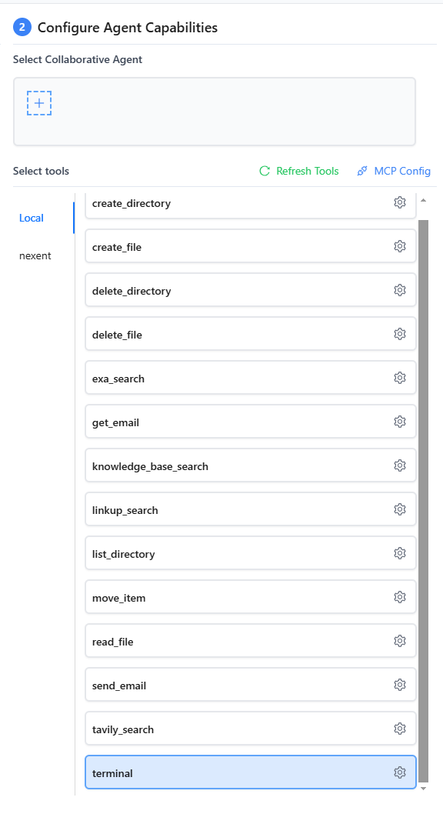
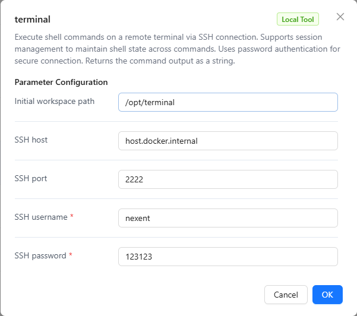

# Terminal Tool User Manual

The Terminal tool is a powerful local tool provided by the Nexent platform that allows agents to execute shell commands on remote servers through SSH connections. The tool supports session management to maintain shell state between commands, uses password authentication for secure connections, and returns command output results. This manual will detail how to configure and use the Terminal tool.

## 🖥️ SSH Server Setup

The Terminal tool supports two SSH server configuration methods:

1. **Nexent Terminal Container**: Use the pre-configured SSH container provided by Nexent (recommended)
2. **Third-party SSH Server**: Set up SSH service on existing servers

### Method 1: Nexent Terminal Container Configuration

Nexent provides a pre-configured Terminal container with a complete SSH server environment and necessary tools, ready to use out of the box.

#### 1. Image Deployment Methods

Nexent Terminal container supports two deployment methods:

##### Method A: Deploy Script Auto-Deployment (Recommended)

```bash
# Use deploy script for automatic pull and deployment
# Script automatically pulls nexent/nexent-ubuntu-terminal from Nexent Docker repository
# Supports development, production, and cloud server deployment

# Container configuration
Container name: nexent-openssh-server
SSH port: 2222
Working directory: /opt/terminal
```

##### Method B: Local Image Build
```bash
# Build Ubuntu Terminal image locally
docker build --progress=plain -t nexent/nexent-ubuntu-terminal -f make/terminal/Dockerfile .
```

> 📚 **Detailed Build Instructions**: Refer to [Docker Build Guide](/en/deployment/docker-build) for complete image build and push processes.

#### 2. Deploy Script Configuration

When running the deployment script, choose to enable the Terminal tool container:

```bash
# Run deployment script
cd docker
bash deploy.sh

# During script execution, select:
# 1. Deployment mode: Choose development/production/infrastructure mode
# 2. Terminal tool: Choose "Y" to enable Terminal tool container
# 3. Configure SSH credentials: Enter username and password
# 4. Configure mount directory: Specify host directory mapping
```

#### 3. Container Features

The Nexent Terminal container includes the following pre-installed tools:

- **Basic Tools**: curl, wget, vim, git
- **Python Environment**: Python3, pip, virtualenv, conda
- **SSH Configuration**: Optimized timeout settings (60-minute sessions)

#### 4. Verify Container Operation

```bash
# Check container status
docker ps | grep nexent-openssh-server

# Test SSH connection
ssh -p 2222 root@localhost

# View container logs
docker logs nexent-openssh-server
```


### Method 2: Third-party SSH Server Setup

If you need to set up SSH service on existing servers, you can use the following two methods:

#### Method A: Container Deployment (Recommended)

**Build and start container directly using Dockerfile**:

##### 1. Create Dockerfile
```dockerfile
FROM ubuntu:24.04

# Set environment variables to avoid interaction
ENV DEBIAN_FRONTEND=noninteractive

# Install openssh-server and common tools
RUN apt-get update && apt-get install -y \
    openssh-server \
    sudo \
    vim \
    bash \
    && rm -rf /var/lib/apt/lists/*

# Create test user and set password
RUN useradd -ms /bin/bash test \
    && echo 'test:test@123' | chpasswd \
    && usermod -aG sudo test

# Set root user password
RUN echo 'root:nexent@123' | chpasswd

# Ensure SSH service directory exists
RUN mkdir /var/run/sshd

# Allow root user to login with password
RUN sed -i 's/#PermitRootLogin prohibit-password/PermitRootLogin yes/' /etc/ssh/sshd_config \
    && sed -i 's/#PasswordAuthentication yes/PasswordAuthentication yes/' /etc/ssh/sshd_config

# Run sshd when container starts
CMD ["/usr/sbin/sshd", "-D"]
```

##### 2. Build and start container
```bash
# Build image
docker build -t nexent-terminal .

# Start container
docker run -d --name nexent-terminal -p 2222:22 nexent-terminal
```

##### 3. Connection information
- **SSH Address**: `localhost:2222`
- **Username**: `test` or `root`
- **Password**: `test@123` or `nexent@123`
- **Container name**: `nexent-terminal`

**Advantages**:
- Custom Ubuntu 24.04 environment
- Pre-installed common development tools
- Supports multi-user access
- Containerized isolation, secure and reliable

#### Method B: Server Configuration

Install and configure SSH service directly on Linux servers:

```bash
# Ubuntu/Debian
sudo apt update && sudo apt install openssh-server -y
sudo systemctl start ssh && sudo systemctl enable ssh

# CentOS/RHEL
sudo yum install openssh-server -y
sudo systemctl start sshd && sudo systemctl enable sshd

# Configure SSH (edit /etc/ssh/sshd_config)
sudo nano /etc/ssh/sshd_config
# Ensure the following configuration:
# PasswordAuthentication yes
# Port 22
# PermitRootLogin yes

# Restart SSH service
sudo systemctl restart ssh
```

**Advantages**:
- Native performance, low resource usage
- Complete control over SSH configuration
- Suitable for long-term production use

#### Selection Recommendations

- **Development/Testing**: Recommend container deployment, quick and convenient
- **Production Environment**: Recommend server configuration, better performance
- **Temporary Use**: Recommend container deployment, delete after use


## 🚀 Tool Features

The Terminal tool provides the following core features:

### Basic Features

- **Remote Command Execution**: Execute shell commands through SSH connections
- **Session Management**: Support multiple sessions, maintain shell state
- **Password Authentication**: Use passwords for SSH authentication
- **Output Cleaning**: Automatically clean control characters and prompts from command output

### Input Parameters

- **command**: Shell command to execute (required)
- **session_name**: Session name for connection reuse (optional, default "default")
- **timeout**: Command timeout time in seconds (optional, default 30)

### Output Format

The tool returns results in JSON format, including:

- **command**: Executed command
- **session_name**: Used session name
- **output**: Command output results
- **timestamp**: Execution timestamp
- **error**: Error information (if execution fails)

## ⚙️ Terminal Tool Configuration

### Configure Terminal Tool in Nexent

1. Log in to the Nexent platform
2. Navigate to the **[Agent Configuration](../agent-configuration)** page
3. Select the agent to configure
4. Find "Terminal Tool" in the "Select Agent Tools" tab

<div style="display: flex; justify-content: center;">
  
</div>

#### Configure SSH Connection Parameters

Click the configuration button for the Terminal tool and fill in the following parameters:

**Basic Configuration**:
- **ssh_host**: SSH server IP address or domain name (Nexent container defaults to nexent-openssh-server)
- **ssh_port**: SSH service port (Nexent container defaults to 2222, third-party servers default to 22)
- **ssh_user**: SSH login username
- **password**: SSH login password
- **init_path**: Initial working directory (defaults to ~)

<div style="display: flex; justify-content: center;">
  
</div>


### Configuration Examples

#### Example 1: Nexent Terminal Container Configuration

```json
{
  "ssh_host": "host.docker.internal",
  "ssh_port": 2222,
  "ssh_user": "root",
  "password": "your-container-password",
  "init_path": "/opt/terminal"
}
```

#### Example 2: Third-party SSH Server Configuration

```json
{
  "ssh_host": "192.168.1.100",
  "ssh_port": 22,
  "ssh_user": "nexent-user",
  "password": "your-secure-password",
  "init_path": "~"
}
```


## 🔧 Common Issues

### Connection Issues

#### Q1: What to do if SSH connection times out?

**A1:** Check the following items:

**Nexent Terminal Container**:

- Whether the container is running normally
- Whether port 2222 is occupied
- Whether there are error messages in container logs

```bash
# Check container status
docker ps | grep nexent-openssh-server

# Check port occupancy
netstat -tlnp | grep :2222

# View container logs
docker logs nexent-openssh-server

# Test container SSH connection
ssh -p 2222 root@localhost
```

**Third-party SSH Server**:

- Whether network connection is normal
- Whether the server SSH service is running
- Whether firewall is blocking connection
- Whether SSH port is correct

```bash
# Check SSH service status
sudo systemctl status ssh

# Check port listening
sudo netstat -tlnp | grep :22

# Test network connectivity
ping your-server-ip
telnet your-server-ip 22
```

#### Q2: How to resolve authentication failure?

**A2:** Check password authentication:
- **Username**: Confirm username is correct
- **Password**: Confirm password is correct, note case sensitivity
- **Server Status**: Confirm SSH service is running normally

```bash
# Test SSH connection
ssh -v username@server-ip

# Check SSH service status
sudo systemctl status ssh
```

### Permission Issues

#### Q3: What to do if command execution has insufficient permissions?

**A3:** Check user permissions:
- Confirm user has permission to execute commands
- Check sudo configuration
- Verify file system permissions

```bash
# Check user groups
groups username

# Check sudo permissions
sudo -l

# Check file permissions
ls -la /path/to/command
```

### Performance Issues

#### Q4: What to do if command execution is very slow?

**A4:** Optimization suggestions:
- Check server performance
- Adjust timeout settings
- Optimize command execution method

```bash
# Check system load
top
htop

# Check disk usage
df -h
iostat -x 1
```

### Security Issues

#### Q5: What to do if Nexent Terminal container cannot start?

**A5:** Check the following items:

```bash
# Check Docker service status
sudo systemctl status docker

# Check container configuration
docker-compose config

# View detailed error logs
docker-compose logs nexent-openssh-server

# Restart container
docker-compose restart nexent-openssh-server

# Check environment variable configuration
cat .env | grep -E "(SSH_USERNAME|SSH_PASSWORD|TERMINAL_MOUNT_DIR)"
```

**Common Solutions**:
- Ensure Docker service is running normally
- Check if port 2222 is occupied by other services
- Verify environment variable configuration is correct
- Check mount directory permissions

#### Q6: How to improve SSH security?

**A6:** Security hardening measures:

**Nexent Terminal Container**:
- Regularly update container images
- Limit access permissions to mount directories
- Monitor container resource usage
- Regularly backup important data

**Third-party SSH Server**:
- Use strong passwords
- Change default SSH port
- Configure IP whitelist
- Enable fail2ban protection

```bash
# Install fail2ban
sudo apt install fail2ban -y

# Configure fail2ban
sudo nano /etc/fail2ban/jail.local

# Add SSH protection configuration
[sshd]
enabled = true
port = ssh
filter = sshd
logpath = /var/log/auth.log
maxretry = 3
bantime = 3600
```

## 🚀 Next Steps

After completing Terminal tool configuration, you can:

1. **[Agent Configuration](../agent-configuration)** - Add Terminal tool to agents
2. **[Chat Interface](../chat-interface)** - Use Terminal tool through agents to execute server management tasks

If you encounter any issues during configuration, please refer to our **[FAQ](../../getting-started/faq)** or join our [Discord Community](https://discord.gg/tb5H3S3wyv) for support.
