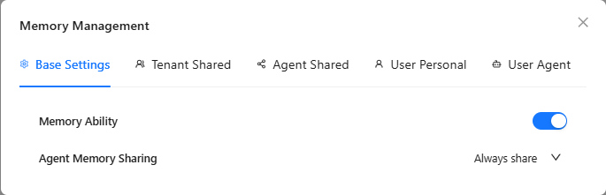
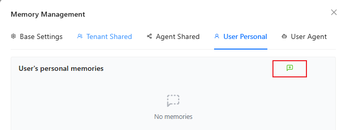
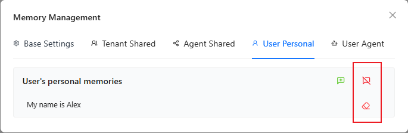

# 🧠Nexent Intelligent Memory System Technical Specification

## 1. System Architecture Overview

The Nexent Intelligent Memory System is built on an advanced memory storage architecture that provides intelligent agents with persistent context-aware capabilities. Through a multi-layered memory management mechanism, the system achieves cross-conversation knowledge accumulation and retrieval, significantly enhancing the coherence and personalization of human-machine interactions.

### Core Technical Features
- **Layered Memory Architecture**: Four-level memory storage system built on the mem0 framework
- **Adaptive Memory Management**: Supports both automated and manual memory operation modes
- **Cross-Session Persistence**: Ensures continuity of knowledge and context across multiple conversations
- **Fine-Grained Permission Control**: Provides flexible memory sharing strategy configuration

---

## 2. Configuration and Initialization

### 2.1 System Activation
1. Access the memory management interface: Click the **Memory Management Icon** in the upper right corner of the conversation interface
2. Enter the **System Configuration** module for initialization settings

### 2.2 Core Configuration Parameters

| Configuration Item | Options | Default Value | Description |
|-------------------|---------|---------------|-------------|
| Memory Service Status | Enable/Disable | Enable | Controls the operational status of the entire memory system |
| Agent Memory Sharing Strategy | Always Share/Ask Me Each Time/Prohibit Sharing | Always Share | Defines whether user authorization consent is required for memory sharing between agents |

  

---

## 3. Layered Memory Architecture

Nexent adopts a four-layer memory storage architecture based on **mem0**, achieving precise memory classification and retrieval through different scopes and lifecycle management:

### 3.1 Architecture Layer Details

| Memory Level | Scope | Storage Content | Lifecycle | Configuration Role | Typical Applications |
|--------------|-------|-----------------|-----------|-------------------|---------------------|
| **Tenant Level Memory** | Organization-wide | Enterprise-level standard operating procedures, compliance policies, organizational structure, factual information | Long-term storage | Tenant Administrator | Enterprise knowledge management, standardized process execution, compliance checking |
| **Agent Level Memory** | Specific Agent | Professional domain knowledge, skill templates, historical conversation summaries, learning accumulation | Consistent with agent lifecycle | Tenant Administrator | Professional skill accumulation, domain knowledge sedimentation, experiential learning |
| **User Level Memory** | Specific User Account | Personal preference settings, usage habits, common instruction templates, personal information | Long-term storage | All Users | Personalized services, user experience optimization, preference management |
| **User-Agent Level Memory** | Specific Agent under Specific User Account | Collaboration history, personalized factual information, specific task context, relationship models | Consistent with agent lifecycle | All Users | Deep collaboration scenarios, personalized tuning, task continuity maintenance |

### 3.2 Memory Priority and Retrieval Strategy

Memory retrieval follows the following priority order (from high to low):
1. **Tenant Level** → Basic facts
2. **User-Agent Level** → Most specific context information
3. **User Level** → Personal preferences and habits
4. **Agent Level** → Professional knowledge and skills

---

## 4. Operation Modes and Functional Interfaces

### 4.1 Automated Memory Management
- **Intelligent Extraction**: Automatically identifies key factual information in conversations and generates memory entries
- **Automatic Context Embedding**: Agents automatically retrieve the most relevant memory entries and implicitly embed them in conversation context
- **Incremental Updates**: Supports progressive updates, supplementation, and automatic cleanup of memory content

### 4.2 Manual Memory Operations

#### Adding Memory
- Click the green plus button, input text, then click the checkmark to add a memory entry (maximum 500 characters)

  

#### Deleting Memory
- Click the red cross button, then click confirm in the popup confirmation dialog to delete all memory entries under a specific Agent group
- Click the red eraser button to delete a specific memory entry

  

### 4.3 Memory Management Best Practices

1. **Atomicity Principle**: Each memory entry should contain **concise**, **single**, **clear** factual information
2. **Temporal Management**: Regularly clean up outdated or no longer relevant memory entries to maintain the timeliness and accuracy of the memory database
3. **Privacy Protection**: Sensitive information should be avoided from being shared at the tenant level or agent level 