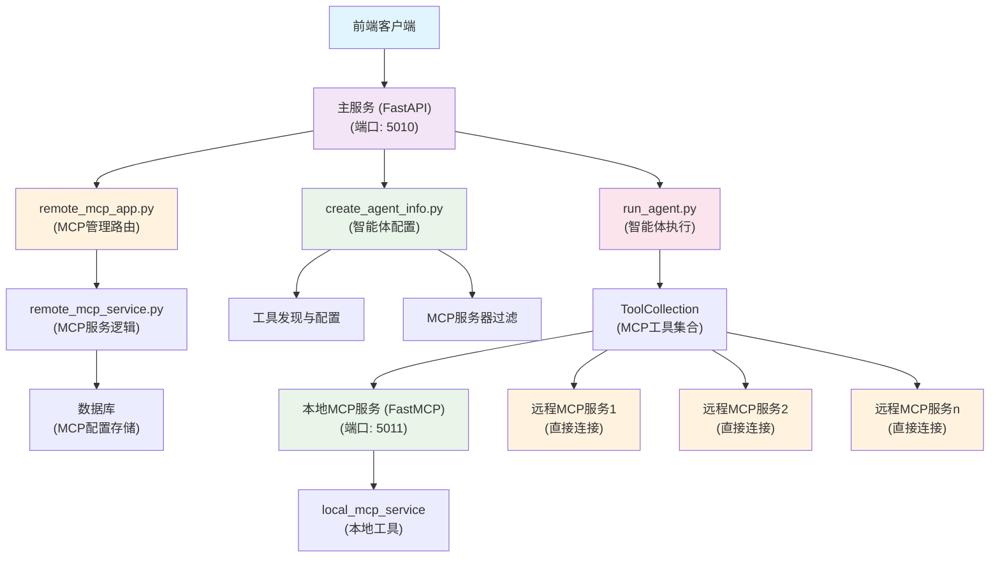
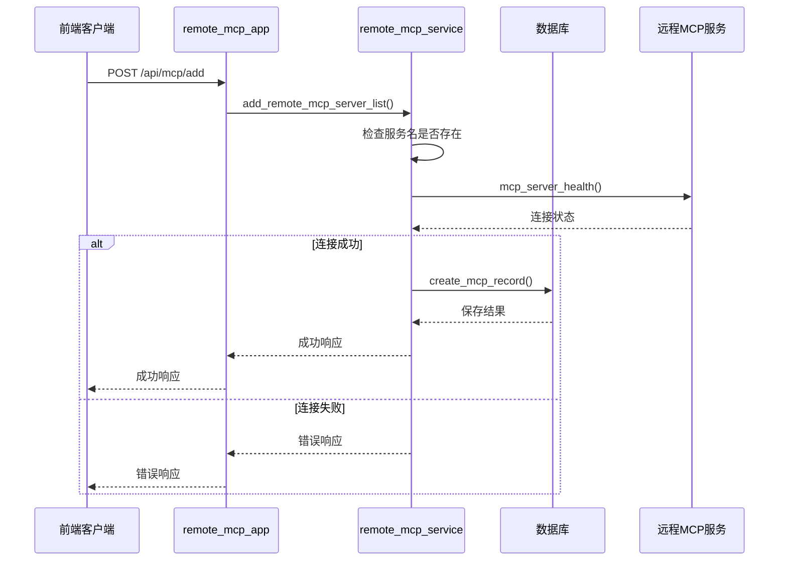
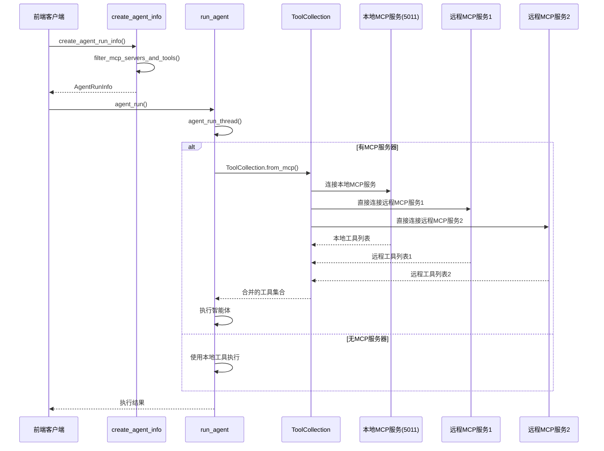

# Nexent MCP架构说明

## 系统架构概述

Nexent采用**本地MCP服务 + 直接远程连接**的架构，通过MCP（Model Context Protocol）协议实现本地服务与远程服务的统一管理。系统包含两个核心服务：

### 1. 主服务 (FastAPI) - 端口 5010
- **用途**：提供Web管理界面和RESTful API，作为前端唯一入口
- **特点**：面向用户管理，包含认证、多租户支持，管理MCP服务器配置
- **启动文件**：`main_service.py`

### 2. 本地MCP服务 (FastMCP) - 端口 5011  
- **用途**：提供本地MCP协议服务，挂载本地工具
- **特点**：MCP协议标准，仅提供本地服务，不代理远程服务
- **启动文件**：`nexent_mcp_service.py`

### 3. 远程MCP服务
- **用途**：外部MCP服务，提供远程工具
- **特点**：智能体执行时直接连接，不通过本地MCP服务代理

## 核心组件架构



## 核心功能模块

### 1. 本地MCP服务管理 (nexent_mcp_service.py)

**本地MCP服务实现**：
```python
# 初始化本地MCP服务
nexent_mcp = FastMCP(name="nexent_mcp")

# 挂载本地服务（稳定，不受远程服务影响）
nexent_mcp.mount(local_mcp_service.name, local_mcp_service)
```

**特点**：
- 仅提供本地MCP服务，挂载本地工具
- 不代理远程MCP服务
- 基于FastMCP框架，提供标准MCP协议支持
- 服务稳定运行，端口5011

### 2. MCP管理API (remote_mcp_app.py)

提供完整的MCP服务器管理接口：

#### 获取远程MCP工具信息
```http
POST /api/mcp/tools?service_name={name}&mcp_url={url}
Authorization: Bearer {token}
```

#### 添加远程MCP服务器
```http
POST /api/mcp/add?mcp_url={url}&service_name={name}
Authorization: Bearer {token}
```

#### 删除远程MCP服务器
```http
DELETE /api/mcp/?service_name={name}&mcp_url={url}
Authorization: Bearer {token}
```

#### 获取MCP服务器列表
```http
GET /api/mcp/list
Authorization: Bearer {token}
```

#### MCP服务器健康检查
```http
GET /api/mcp/healthcheck?mcp_url={url}&service_name={name}
Authorization: Bearer {token}
```

### 3. MCP服务逻辑 (remote_mcp_service.py)

**核心功能**：

#### 服务器健康检查
```python
async def mcp_server_health(remote_mcp_server: str) -> JSONResponse:
    # 使用FastMCP Client验证远程服务连接
    client = Client(remote_mcp_server)
    async with client:
        connected = client.is_connected()
        # 返回连接状态
```

#### 添加MCP服务器
```python
async def add_remote_mcp_server_list(tenant_id, user_id, remote_mcp_server, remote_mcp_server_name):
    # 1. 检查服务名是否已存在
    # 2. 验证远程服务连接
    # 3. 保存到数据库
    # 4. 返回操作结果
```

#### 删除MCP服务器
```python
async def delete_remote_mcp_server_list(tenant_id, user_id, remote_mcp_server, remote_mcp_server_name):
    # 1. 从数据库删除记录
    # 2. 返回操作结果
```

### 4. 智能体配置管理 (create_agent_info.py)

**MCP服务器过滤机制**：
```python
def filter_mcp_servers_and_tools(input_agent_config: AgentConfig, mcp_info_dict) -> list:
    """
    过滤MCP服务器和工具，只保留实际使用的MCP服务器
    支持多级智能体，递归检查所有子智能体工具
    """
    used_mcp_urls = set()
    
    def check_agent_tools(agent_config: AgentConfig):
        # 检查当前智能体工具
        for tool in agent_config.tools:
            if tool.source == "mcp" and tool.usage in mcp_info_dict:
                used_mcp_urls.add(mcp_info_dict[tool.usage]["remote_mcp_server"])
        
        # 递归检查子智能体
        for sub_agent_config in agent_config.managed_agents:
            check_agent_tools(sub_agent_config)
    
    check_agent_tools(input_agent_config)
    return list(used_mcp_urls)
```

**智能体运行信息创建**：
```python
async def create_agent_run_info(agent_id, minio_files, query, history, authorization, language='zh'):
    # 1. 获取用户和租户信息
    # 2. 创建模型配置列表
    # 3. 创建智能体配置
    # 4. 获取远程MCP服务器列表
    # 5. 过滤实际使用的MCP服务器
    # 6. 创建智能体运行信息
```

### 5. 智能体执行引擎 (run_agent.py)

**MCP工具集成**：
```python
def agent_run_thread(agent_run_info: AgentRunInfo, memory_context: MemoryContext):
    mcp_host = agent_run_info.mcp_host
    
    if mcp_host is None or len(mcp_host) == 0:
        # 无MCP服务器：使用本地工具
        nexent = NexentAgent(...)
        agent = nexent.create_single_agent(agent_run_info.agent_config)
        # ...
    else:
        # 有MCP服务器：使用ToolCollection直接连接所有MCP服务
        agent_run_info.observer.add_message("", ProcessType.AGENT_NEW_RUN, "<MCP_START>")
        mcp_client_list = [{"url": mcp_url} for mcp_url in mcp_host]
        
        with ToolCollection.from_mcp(mcp_client_list, trust_remote_code=True) as tool_collection:
            # ToolCollection会同时连接本地MCP服务(5011)和远程MCP服务
            nexent = NexentAgent(
                mcp_tool_collection=tool_collection,
                # ...
            )
            # 执行智能体
```

## 数据流程

### 1. MCP服务器添加流程



### 2. 智能体执行流程



## 关键特性

### 1. 多租户隔离
- 所有MCP服务器配置基于`tenant_id`进行隔离
- 用户只能访问自己租户的MCP服务器

### 2. 动态MCP管理
- 支持运行时添加、删除MCP服务器配置
- 自动健康检查和状态更新
- 数据库持久化存储配置
- 智能体执行时直接连接远程MCP服务

### 3. 智能工具过滤
- 只连接智能体实际使用的MCP服务器
- 支持多级智能体的递归工具检查
- 避免不必要的网络连接
- 本地MCP服务(5011)始终可用，远程服务按需连接

### 4. 错误处理
- MCP连接失败时的优雅降级
- 详细的错误日志和状态反馈
- 连接超时保护机制

### 5. 内存管理
- 智能体执行完成后自动保存对话记忆
- 支持多级记忆存储（租户、智能体、用户、用户智能体）
- 可配置的记忆共享策略

## 配置说明

### 环境变量
```bash
# MCP服务地址
NEXENT_MCP_SERVER=http://localhost:5011

# 数据库配置
DATABASE_URL=postgresql://...

# 其他配置...
```

### 数据库表结构
```sql
-- MCP服务器配置表
CREATE TABLE mcp_servers (
    id SERIAL PRIMARY KEY,
    tenant_id VARCHAR NOT NULL,
    user_id VARCHAR NOT NULL,
    mcp_name VARCHAR NOT NULL,
    mcp_server VARCHAR NOT NULL,
    status BOOLEAN DEFAULT true,
    created_at TIMESTAMP DEFAULT NOW(),
    updated_at TIMESTAMP DEFAULT NOW()
);
```

## 使用示例

### 1. 启动服务
```bash
# 启动主服务
cd backend
python main_service.py

# 启动本地MCP服务
cd backend
python nexent_mcp_service.py
```

### 2. 添加远程MCP服务器
```bash
curl -X POST "http://localhost:5010/api/mcp/add?mcp_url=http://external-server:5012/sse&service_name=external_service" \
  -H "Authorization: Bearer {your_token}"
```

## 性能优化

### 1. 连接池管理
- MCP客户端连接复用
- 自动连接超时和重试机制
- ToolCollection统一管理多个MCP服务连接

### 2. 工具缓存
- 工具信息本地缓存
- 减少重复的MCP服务查询

### 3. 异步处理
- 所有MCP操作采用异步模式
- 支持并发智能体执行

## 安全考虑

### 1. 认证授权
- 所有API接口需要Bearer token认证
- 基于租户的数据隔离

### 2. 连接验证
- 添加MCP服务器前进行连通性验证
- 支持HTTPS和SSE安全传输

### 3. 错误处理
- 详细的错误日志记录
- 敏感信息脱敏处理

## 故障排除

### 常见问题

1. **MCP连接失败**
   - 检查远程MCP服务是否正常运行
   - 验证网络连接和防火墙设置
   - 查看服务日志获取详细错误信息

2. **工具加载失败**
   - 确认MCP服务器支持所需的工具
   - 检查工具配置是否正确
   - 验证权限设置

3. **性能问题**
   - 监控MCP服务器响应时间
   - 检查网络延迟
   - 优化工具过滤逻辑

### 调试工具

```python
# 检查MCP服务器健康状态
response = await mcp_server_health("http://remote-server:port/sse")

# 获取MCP服务器列表
servers = await get_remote_mcp_server_list(tenant_id)

# 查看智能体使用的MCP服务器
mcp_hosts = filter_mcp_servers_and_tools(agent_config, mcp_info_dict)

# 查看本地MCP服务状态
# 本地MCP服务运行在端口5011，提供本地工具
```
