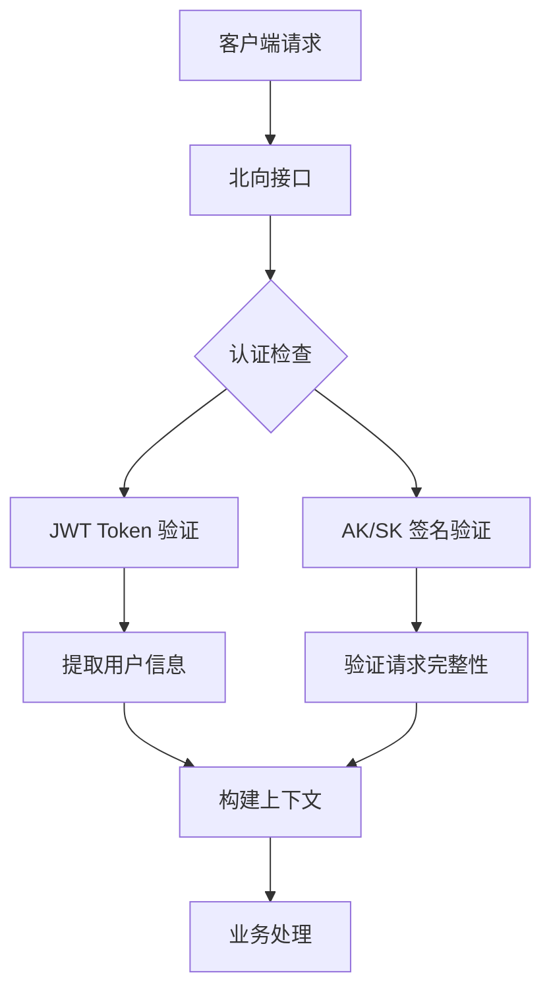
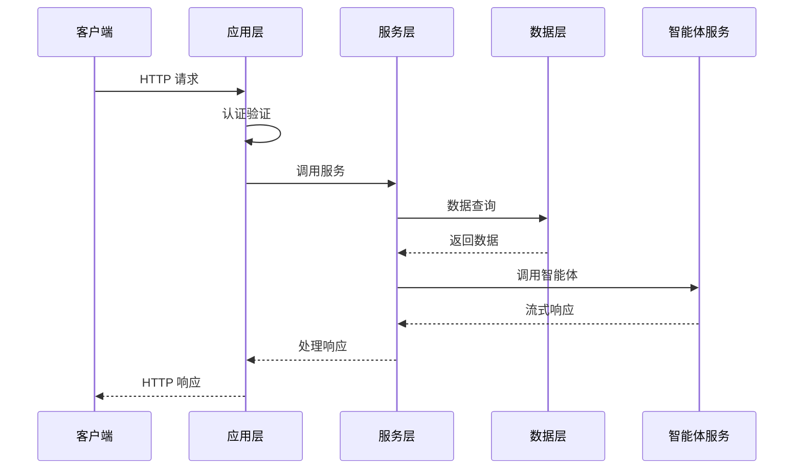
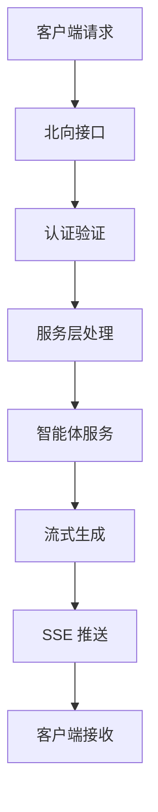
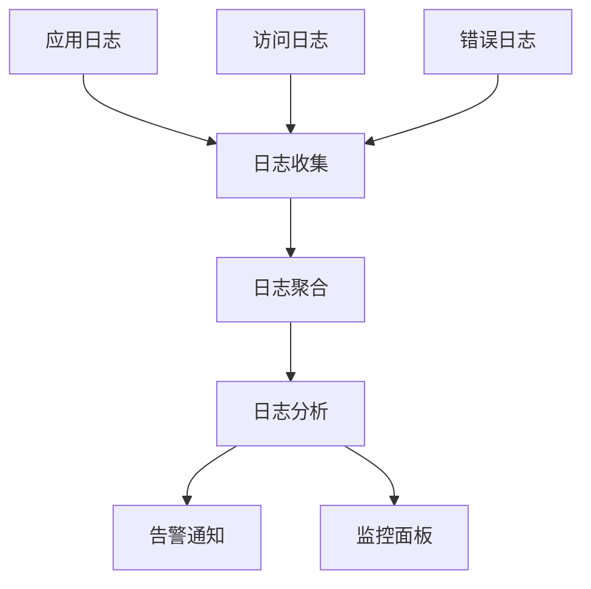

# 北向接口架构说明

## 系统架构概览

北向接口采用分层架构设计，提供安全、可靠、高性能的 API 服务。

## 架构组件

### 1. 应用层 (App Layer)

**文件位置**: `backend/apps/northbound_app.py`, `backend/apps/northbound_base_app.py`

**职责**:
- HTTP 请求处理和响应
- 请求参数验证
- 认证和授权
- 异常处理和状态码映射
- 跨域支持 (CORS)

**核心功能**:
```python
# 请求处理流程
@router.post("/chat/run")
async def run_chat(request: Request, ...):
    # 1. 解析北向上下文（认证）
    ctx = await _parse_northbound_context(request)
    
    # 2. 调用服务层
    return await start_streaming_chat(ctx, ...)
    
    # 3. 异常处理
    except UnauthorizedError as e:
        raise HTTPException(status_code=401, detail=str(e))
```

### 2. 服务层 (Service Layer)

**文件位置**: `backend/services/northbound_service.py`

**职责**:
- 核心业务逻辑实现
- 数据转换和映射
- 外部系统集成
- 幂等性控制
- 频率限制

**核心功能**:
```python
# 业务逻辑处理
async def start_streaming_chat(ctx, external_conversation_id, agent_name, query):
    # 1. 频率限制检查
    await check_and_consume_rate_limit(ctx.tenant_id)
    
    # 2. ID 映射转换
    internal_id = await to_internal_conversation_id(external_conversation_id)
    
    # 3. 幂等性控制
    await idempotency_start(composed_key)
    
    # 4. 调用智能体服务
    return await run_agent_stream(agent_request, ...)
```

### 3. 数据层 (Data Layer)

**职责**:
- 数据库操作
- ID 映射管理
- 会话数据存储
- 智能体信息查询

**核心组件**:
- `database/conversation_db.py`: 会话数据管理
- `database/partner_db.py`: 合作伙伴数据管理
- `database/agent_db.py`: 智能体数据管理

## 认证架构

### 双重认证体系



### 认证流程

1. **JWT Token 验证**
   - 验证 Token 有效性
   - 提取 `user_id` 和 `tenant_id`
   - 检查用户权限

2. **AK/SK 签名验证**
   - 验证请求签名
   - 检查时间戳有效性
   - 防止重放攻击

## 数据流架构

### 请求处理流程



### 流式响应架构



## 安全架构

### 安全防护层级

1. **网络层安全**
   - HTTPS 加密传输
   - 防火墙规则
   - DDoS 防护

2. **应用层安全**
   - 双重认证机制
   - 请求签名验证
   - 频率限制

3. **数据层安全**
   - 数据加密存储
   - 访问权限控制
   - 审计日志

### 安全特性

- **请求签名**: HMAC-SHA256 签名防止篡改
- **时间戳验证**: 防止重放攻击
- **频率限制**: 防止滥用和攻击
- **幂等性控制**: 防止重复操作
- **审计日志**: 完整的操作记录

## 性能架构

### 性能优化策略

1. **连接池管理**
   - HTTP 连接复用
   - 异步处理
   - 连接超时控制

2. **缓存策略**
   - 智能体信息缓存
   - 会话数据缓存
   - 响应结果缓存

3. **流式处理**
   - Server-Sent Events (SSE)
   - 实时数据推送
   - 内存优化

### 性能指标

- **响应时间**: < 100ms (非流式接口)
- **吞吐量**: 1000+ QPS
- **并发连接**: 10000+ 并发
- **流式延迟**: < 50ms

## 监控架构

### 监控体系

1. **应用监控**
   - 请求量和响应时间
   - 错误率和异常
   - 资源使用情况

2. **业务监控**
   - 智能体调用统计
   - 会话创建和活跃度
   - 用户行为分析

3. **基础设施监控**
   - 服务器性能
   - 数据库性能
   - 网络状况

### 日志架构



## 部署架构

### 部署模式

1. **单机部署**
   - 适用于开发和测试
   - 资源需求较低
   - 配置简单

2. **集群部署**
   - 适用于生产环境
   - 高可用性
   - 负载均衡

3. **容器化部署**
   - Docker 容器
   - Kubernetes 编排
   - 弹性伸缩

### 环境配置

```yaml
# docker-compose.yml 示例
version: '3.8'
services:
  northbound-api:
    image: nexent/northbound-api:latest
    ports:
      - "5013:5013"
    environment:
      - JWT_SECRET=your_jwt_secret
      - DATABASE_URL=postgresql://...
    depends_on:
      - postgres
      - redis
```

## 扩展架构

### 水平扩展

1. **负载均衡**
   - 多实例部署
   - 请求分发
   - 健康检查

2. **数据库扩展**
   - 读写分离
   - 分库分表
   - 缓存层

3. **服务扩展**
   - 微服务拆分
   - 服务网格
   - API 网关

### 功能扩展

1. **新接口添加**
   - 遵循现有模式
   - 统一认证机制
   - 完整文档更新

2. **功能增强**
   - 向后兼容
   - 渐进式升级
   - 平滑迁移

## 最佳实践

### 开发最佳实践

1. **代码规范**
   - 遵循分层架构
   - 统一异常处理
   - 完整单元测试

2. **安全最佳实践**
   - 输入验证
   - 输出编码
   - 最小权限原则

3. **性能最佳实践**
   - 异步处理
   - 连接池管理
   - 缓存策略

### 运维最佳实践

1. **监控告警**
   - 关键指标监控
   - 异常告警
   - 性能分析

2. **日志管理**
   - 结构化日志
   - 日志轮转
   - 敏感信息脱敏

3. **备份恢复**
   - 数据备份
   - 配置备份
   - 灾难恢复

---

*架构说明文档 - 深入了解北向接口的技术实现*
