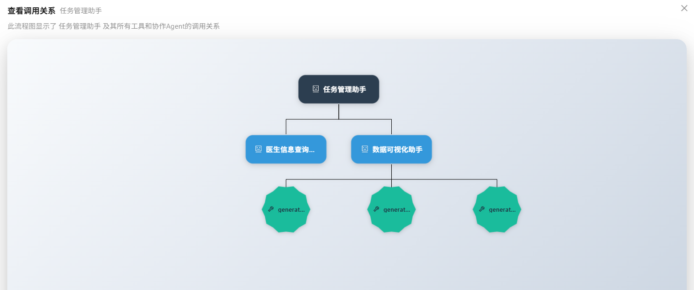

# 智能体开发

在智能体开发页面中，您可以创建、配置和管理智能体。智能体是 Nexent 的核心功能，它们能够理解您的需求并执行相应的任务。

## 🔧 创建智能体

在 Agent 管理页签下，点击"创建 Agent"即可创建一个空白智能体，点击"退出创建"即可退出创建模式。
如果您有现成的智能体配置，也可以导入使用：

1. 点击"导入 Agent"
2. 在弹出的文件选择对话框中选择智能体配置文件（JSON 格式）
3. 点击"打开"按钮，系统会验证配置文件的格式和内容，并显示导入的智能体信息

  

## 👥 配置协作智能体/工具

您可以为创建的智能体配置其他协作智能体，也可以为它配置可使用的工具，以赋予智能体能力完成复杂任务。

### 🤝 协作 Agent

1. 点击"协作 Agent"页签下的加号，弹出可选择的智能体列表
2. 在下拉列表中选择要添加的智能体
3. 允许选择多个协作智能体
4. 可点击 × 取消选择此智能体

  

### 🛠️ 选择 Agent 的工具

智能体可以使用各种工具来完成任务，如知识库检索、文件解析、图片解析、收发邮件、文件管理等本地工具，也可接入第三方 MCP 工具，或自定义工具。

1. 在"选择 Agent 的工具"页签右侧，点击"刷新工具"来刷新可用工具列表
2. 选择想要添加工具所在的分组
3. 查看分组下可选用的所有工具，可点击 ⚙️ 查看工具描述，进行工具参数配置
4. 点击工具名即可选中该工具，再次点击可取消选择
   - 如果工具有必备参数没有配置，选择时会弹出弹窗引导进行参数配置
   - 如果所有必备参数已配置完成，选择则会直接选中

  

> 💡 **小贴士**：
> 1. 请选择 `knowledge_base_search` 工具，启用知识库的检索功能。
> 2. 请选择 `analyze_text_file` 工具，启用文档类、文本类文件的解析功能。
> 3. 请选择 `analyze_image` 工具，启用图片类文件的解析功能。
> 
> 📚 想了解系统已经内置的所有本地工具能力？请参阅 [本地工具概览](./local-tools/index.md)。

### 🔌 添加 MCP 工具

Nexent 支持您快速便捷地使用第三方 MCP 工具，丰富 Agent 能力。

1. 在"选择 Agent 的工具"页签右侧，点击"MCP 配置"，可在弹窗中进行 MCP 服务器的配置，查看已配置的 MCP 服务器
2. 输入服务器名称和服务器 URL（目前仅支持 SSE 协议）
   - ⚠️ **注意**：服务器名称只能包含英文字母和数字，不能包含空格、下划线等其他字符
3. 点击"添加"按钮，即可完成添加

  

有许多第三方服务如 [ModelScope](https://www.modelscope.cn/mcp) 提供了 MCP 服务，您可以快速接入使用。
您也可以自行开发 MCP 服务并接入 Nexent 使用，参考文档 [MCP 服务开发](../mcp-ecosystem/mcp-server-development.md)。

### ⚙️ 自定义工具

您可参考以下指导文档，开发自己的工具，并接入 Nexent 使用，丰富 Agent 能力。

- [LangChain 工具指南](../backend/tools/langchain)
- [MCP 工具开发](../backend/tools/mcp)
- [SDK 工具文档](../sdk/core/tools)

### 🧪 工具测试

无论是什么类型的工具（内置工具、外部接入的 MCP 工具，还是自定义开发工具），Nexent 都提供了"工具测试"能力。如果您在创建 Agent 时不确定某个工具的效果，可以使用测试功能来验证工具是否按预期工作。

1. 点击工具的小齿轮按钮 ⚙️，进入工具的详细配置弹窗
2. 首先确保已经配置了工具的必备参数（带红色星号的参数）
3. 在弹窗的左下角点击"工具测试"按钮
4. 右侧会新弹出一个测试框
5. 在测试框中输入测试工具的入参，例如：
   - 测试本地知识库检索工具 `knowledge_base_search` 时，需要输入：
     - 测试的 `query`，例如"维生素C的功效"
     - 检索的模式 `search_mode`（默认为 `hybrid`）
     - 目标检索的知识库列表 `index_names`，如 `["医疗", "维生素知识大全"]`
     - 若不输入 `index_names`，则默认检索知识库页面所选中的全部知识库
6. 输入完成后点击"执行测试"开始测试，并在下方查看测试结果

  

## 📝 描述业务逻辑

### ✍️ 描述 Agent 应该如何工作

根据选择的协作 Agent 和工具，您现在可以用简洁的语言来描述，您希望这个 Agent 应该如何工作。Nexent 会根据您的配置和描述，自动为您生成 Agent 名称、描述以及提示词等信息。

1. 在"描述 Agent 应该如何工作"下的编辑框中，输入简洁描述，如"你是一个专业的知识问答小助手，具备本地知识检索和联网检索能力，综合信息以回答用户问题"
2. 点击"生成智能体"按钮，Nexent 会为您生成 Agent 详细内容，包括基础信息以及提示词（角色、使用要求、示例）
3. 您可在下方 Agent 详细内容中，针对自动生成的内容（特别是提示词）进行编辑微调

  

### 🐛 调试与保存

在完成初步 Agent 配置后，您可以对 Agent 进行调试，根据调试结果微调提示词，持续提升 Agent 表现。

1. 在页面右下角点击"调试"按钮，弹出智能体调试页面
2. 与智能体进行测试对话，观察智能体的响应和行为
3. 查看对话表现和错误信息，根据测试结果优化智能体提示词

调试成功后，可点击右下角"保存"按钮，此智能体将会被保存并出现在智能体列表中。

## 📋 管理智能体

在左侧智能体列表中，您可对已有的智能体进行以下操作：

### 🔗 查看调用关系

查看智能体所使用的协作智能体/工具，以树状图形式明晰查看智能体调用关系。

  

### 📤 导出

可将调试成功的智能体导出为 JSON 配置文件，在创建 Agent 时可以使用此 JSON 文件以导入的方式创建副本。

### 🗑️ 删除

删除智能体（不可撤销，请谨慎操作）。

## 🚀 下一步

完成智能体开发后，您可以：

1. 在 **[智能体空间](./agent-space)** 中查看和管理所有智能体
2. 在 **[开始问答](./start-chat)** 中与智能体进行交互
3. 在 **[记忆管理](./memory-management)** 配置记忆以提升智能体的个性化能力

如果您在智能体开发过程中遇到任何问题，请参考我们的 **[常见问题](../getting-started/faq)** 或在 [GitHub Discussions](https://github.com/ModelEngine-Group/nexent/discussions) 中进行提问获取支持。
