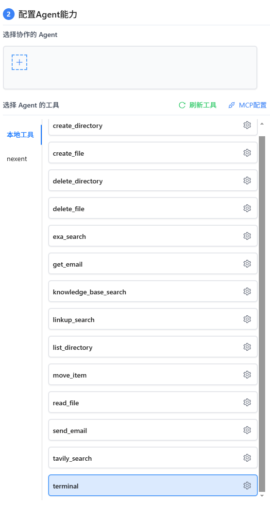
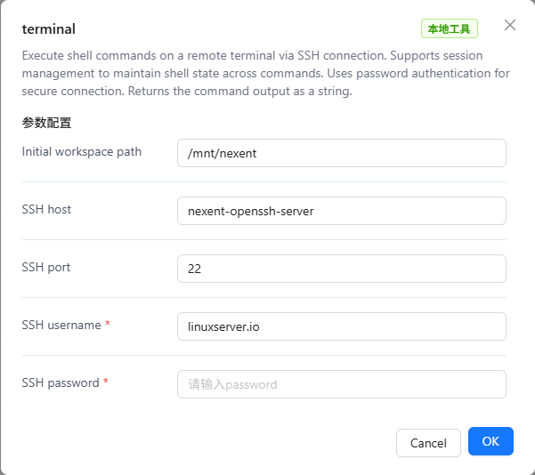

# Terminal工具使用手册

Terminal工具是Nexent平台提供的一个强大的本地工具，允许智能体通过SSH连接远程服务器执行shell命令。该工具支持会话管理以在命令之间保持shell状态，使用密码认证进行安全连接，并返回命令输出结果。本手册将详细介绍如何配置和使用Terminal工具。

## 🖥️ SSH服务器搭建

Terminal工具支持两种SSH服务器配置方式：

1. **Nexent Terminal容器**：使用Nexent提供的预配置SSH容器（推荐）
2. **第三方SSH服务器**：在现有服务器上搭建SSH服务

### 方式一：Nexent Terminal容器配置

Nexent提供了预配置的Terminal容器，包含完整的SSH服务器环境和必要的工具，开箱即用。

#### 1. 镜像部署方式

Nexent Terminal容器支持两种部署方式：

##### 方式A：Deploy脚本自动部署（推荐）

```bash
# 使用deploy脚本自动拉取和部署
# 脚本会自动从Nexent Docker仓库拉取 nexent/nexent-ubuntu-terminal 镜像
# 支持开发环境、生产环境和云服务器部署

# 容器配置信息
容器名称: nexent-openssh-server
SSH端口: 2222
工作目录: /opt/terminal
```

##### 方式B：本地构建镜像
```bash
# 本地构建Ubuntu Terminal镜像
docker build --progress=plain -t nexent/nexent-ubuntu-terminal -f make/terminal/Dockerfile .
```

> 📚 **详细构建说明**：参考 [Docker 构建指南](/zh/deployment/docker-build) 了解完整的镜像构建和推送流程。

#### 2. Deploy脚本配置

在运行部署脚本时，选择启用Terminal工具容器：

```bash
# 运行部署脚本
cd docker
bash deploy.sh

# 在脚本执行过程中选择：
# 1. 部署模式：选择开发/生产/基础设施模式
# 2. Terminal工具：选择 "Y" 启用Terminal工具容器
# 3. 配置SSH凭据：输入用户名和密码
# 4. 配置挂载目录：指定主机目录映射
```

#### 3. 容器特性

Nexent Terminal容器包含以下预装工具：

- **基础工具**：curl, wget, vim, git
- **Python环境**：Python3, pip, virtualenv, conda
- **SSH配置**：优化的超时设置（60分钟会话）

#### 4. 验证容器运行

```bash
# 检查容器状态
docker ps | grep nexent-openssh-server

# 测试SSH连接
ssh -p 2222 root@localhost

# 查看容器日志
docker logs nexent-openssh-server
```


### 方式二：第三方SSH服务器搭建

如果您需要在现有服务器上搭建SSH服务，可以使用以下两种方式：

#### 方式A：容器部署（推荐）

**直接使用Dockerfile构建并启动容器**：

##### 1. 创建Dockerfile
```dockerfile
FROM ubuntu:24.04

# 设置环境变量避免交互
ENV DEBIAN_FRONTEND=noninteractive

# 安装 openssh-server 和常用工具
RUN apt-get update && apt-get install -y \
    openssh-server \
    sudo \
    vim \
    bash \
    && rm -rf /var/lib/apt/lists/*

# 创建 test 用户并设置密码
RUN useradd -ms /bin/bash test \
    && echo 'test:test@123' | chpasswd \
    && usermod -aG sudo test

# 设置 root 用户密码
RUN echo 'root:nexent@123' | chpasswd

# 确保 SSH 服务目录存在
RUN mkdir /var/run/sshd

# 允许 root 用户使用密码登录
RUN sed -i 's/#PermitRootLogin prohibit-password/PermitRootLogin yes/' /etc/ssh/sshd_config \
    && sed -i 's/#PasswordAuthentication yes/PasswordAuthentication yes/' /etc/ssh/sshd_config

# 容器启动时运行 sshd
CMD ["/usr/sbin/sshd", "-D"]
```

##### 2. 构建并启动容器
```bash
# 构建镜像
docker build -t nexent-terminal .

# 启动容器
docker run -d --name nexent-terminal -p 2222:22 nexent-terminal
```

##### 3. 连接信息
- **SSH地址**: `localhost:2222`
- **用户名**: `test` 或 `root`
- **密码**: `test@123` 或 `nexent@123`
- **容器名称**: `nexent-terminal`

**优势**：
- 自定义Ubuntu 24.04环境
- 预装常用开发工具
- 支持多用户访问
- 容器化隔离，安全可靠

#### 方式B：服务器配置

在Linux服务器上直接安装配置SSH服务：

```bash
# Ubuntu/Debian
sudo apt update && sudo apt install openssh-server -y
sudo systemctl start ssh && sudo systemctl enable ssh

# CentOS/RHEL
sudo yum install openssh-server -y
sudo systemctl start sshd && sudo systemctl enable sshd

# 配置SSH（编辑 /etc/ssh/sshd_config）
sudo nano /etc/ssh/sshd_config
# 确保以下配置：
# PasswordAuthentication yes
# Port 22
# PermitRootLogin yes

# 重启SSH服务
sudo systemctl restart ssh
```

**优势**：
- 原生性能，资源占用少
- 完全控制SSH配置
- 适合生产环境长期使用

#### 选择建议

- **开发测试**：推荐使用容器部署，快速便捷
- **生产环境**：推荐服务器配置，性能更优
- **临时使用**：推荐容器部署，用完即删


## 🚀 工具功能

Terminal工具提供以下核心功能：

### 基本功能

- **远程命令执行**：通过SSH连接执行shell命令
- **会话管理**：支持多个会话，保持shell状态
- **密码认证**：使用密码进行SSH身份验证
- **输出清理**：自动清理命令输出中的控制字符和提示符

### 输入参数

- **command**：要执行的shell命令（必需）
- **session_name**：会话名称，用于连接复用（可选，默认"default"）
- **timeout**：命令超时时间，单位秒（可选，默认30）

### 输出格式

工具返回JSON格式的结果，包含：

- **command**：执行的命令
- **session_name**：使用的会话名称
- **output**：命令输出结果
- **timestamp**：执行时间戳
- **error**：错误信息（如果执行失败）

## ⚙️ Terminal工具配置

### 在Nexent中配置Terminal工具

1. 登录Nexent平台
2. 进入 **[智能体配置](../agent-configuration)** 页面
3. 选择要配置的智能体
4. 在"选择Agent的工具"页签中找到"Terminal工具"

<div style="display: flex; justify-content: center;">
  
</div>

#### 配置SSH连接参数

点击Terminal工具的配置按钮，填写以下参数：

**基本配置**：
- **ssh_host**：SSH服务器的IP地址或域名（Nexent容器默认为nexent-openssh-server）
- **ssh_port**：SSH服务端口（Nexent容器默认2222，第三方服务器默认22）
- **ssh_user**：SSH登录用户名
- **password**：SSH登录密码
- **init_path**：初始工作目录（默认为~）

<div style="display: flex; justify-content: center;">
  
</div>


### 配置示例

#### 示例1：Nexent Terminal容器配置

```json
{
  "ssh_host": "host.docker.internal",
  "ssh_port": 2222,
  "ssh_user": "root",
  "password": "your-container-password",
  "init_path": "/opt/terminal"
}
```

#### 示例2：第三方SSH服务器配置

```json
{
  "ssh_host": "192.168.1.100",
  "ssh_port": 22,
  "ssh_user": "nexent-user",
  "password": "your-secure-password",
  "init_path": "~"
}
```


## 🔧 常见问题

### 连接问题

#### Q1：SSH连接超时怎么办？

**A1：** 检查以下项目：

**Nexent Terminal容器**：

- 容器是否正常运行
- 端口2222是否被占用
- 容器日志是否有错误信息

```bash
# 检查容器状态
docker ps | grep nexent-openssh-server

# 检查端口占用
netstat -tlnp | grep :2222

# 查看容器日志
docker logs nexent-openssh-server

# 测试容器SSH连接
ssh -p 2222 root@localhost
```

**第三方SSH服务器**：

- 网络连接是否正常
- 服务器SSH服务是否运行
- 防火墙是否阻止连接
- SSH端口是否正确

```bash
# 检查SSH服务状态
sudo systemctl status ssh

# 检查端口监听
sudo netstat -tlnp | grep :22

# 测试网络连通性
ping your-server-ip
telnet your-server-ip 22
```

#### Q2：认证失败怎么解决？

**A2：** 检查密码认证：
- **用户名**：确认用户名正确
- **密码**：确认密码正确，注意大小写
- **服务器状态**：确认SSH服务正常运行

```bash
# 测试SSH连接
ssh -v username@server-ip

# 检查SSH服务状态
sudo systemctl status ssh
```

### 权限问题

#### Q3：命令执行权限不足怎么办？

**A3：** 检查用户权限：
- 确认用户有执行命令的权限
- 检查sudo配置
- 验证文件系统权限

```bash
# 检查用户组
groups username

# 检查sudo权限
sudo -l

# 检查文件权限
ls -la /path/to/command
```

### 性能问题

#### Q4：命令执行很慢怎么办？

**A4：** 优化建议：
- 检查服务器性能
- 调整超时设置
- 优化命令执行方式

```bash
# 检查系统负载
top
htop

# 检查磁盘使用
df -h
iostat -x 1
```

### 安全问题

#### Q5：Nexent Terminal容器无法启动怎么办？

**A5：** 检查以下项目：

```bash
# 检查Docker服务状态
sudo systemctl status docker

# 检查容器配置
docker-compose config

# 查看详细错误日志
docker-compose logs nexent-openssh-server

# 重新启动容器
docker-compose restart nexent-openssh-server

# 检查环境变量配置
cat .env | grep -E "(SSH_USERNAME|SSH_PASSWORD|TERMINAL_MOUNT_DIR)"
```

**常见解决方案**：
- 确保Docker服务正常运行
- 检查端口2222是否被其他服务占用
- 验证环境变量配置是否正确
- 检查挂载目录权限

#### Q6：如何提高SSH安全性？

**A6：** 安全加固措施：

**Nexent Terminal容器**：
- 定期更新容器镜像
- 限制挂载目录的访问权限
- 监控容器资源使用情况
- 定期备份重要数据

**第三方SSH服务器**：
- 使用强密码
- 修改默认SSH端口
- 配置IP白名单
- 启用fail2ban防护

```bash
# 安装fail2ban
sudo apt install fail2ban -y

# 配置fail2ban
sudo nano /etc/fail2ban/jail.local

# 添加SSH保护配置
[sshd]
enabled = true
port = ssh
filter = sshd
logpath = /var/log/auth.log
maxretry = 3
bantime = 3600
```

## 🚀 下一步

完成Terminal工具配置后，您可以：

1. **[智能体配置](../agent-configuration)** - 将Terminal工具添加到智能体中
2. **[对话页面](../chat-interface)** - 通过智能体使用Terminal工具执行服务器管理任务

如果您在配置过程中遇到任何问题，请参考我们的 **[常见问题](../../getting-started/faq)** 或加入我们的 [Discord 社区](https://discord.gg/tb5H3S3wyv) 获取支持。
