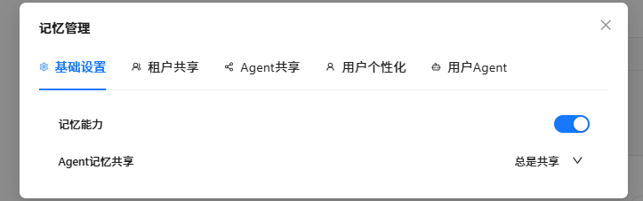
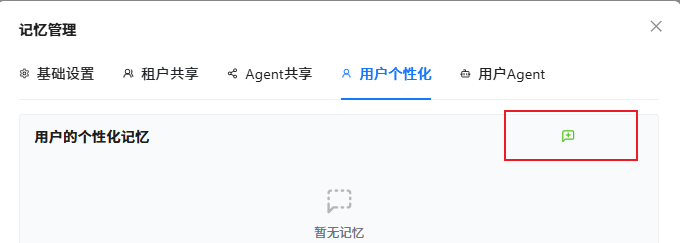
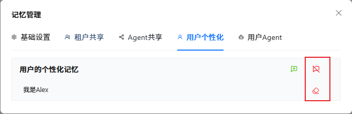

# 🧠Nexent 智能记忆系统技术规格说明

## 1. 系统架构概述

Nexent 智能记忆系统基于先进的记忆存储架构，为智能体提供持久化的上下文感知能力。该系统通过多层级记忆管理机制，实现了跨对话会话的知识累积与检索，显著提升了人机交互的连贯性和个性化程度。

### 核心技术特性
- **分层记忆架构**：基于 mem0 框架构建的四级记忆存储体系
- **自适应记忆管理**：支持自动化和手动化的记忆操作模式
- **跨会话持久化**：确保知识和上下文在多次对话中的连续性
- **细粒度权限控制**：提供灵活的记忆共享策略配置

---

## 2. 配置与初始化

### 2.1 系统激活
1. 访问记忆管理界面：点击对话界面右上角的**记忆管理图标**
2. 进入**系统配置**模块进行初始化设置

### 2.2 核心配置参数

| 配置项 | 选项              | 默认值 | 说明                       |
|--------|-----------------|--------|--------------------------|
| 记忆服务状态 | 启用/禁用           | 启用 | 控制整个记忆系统的运行状态            |
| Agent 记忆共享策略 | 总是共享/每次询问我/禁止共享 | 总是共享 | 定义Agent间共享记忆生成是否需要用户授权同意 |

  

---

## 3. 分层记忆架构

Nexent 采用基于 **mem0** 的四层记忆存储架构，通过不同的作用域和生命周期管理，实现精确的记忆分类与检索：

### 3.1 架构层级详解

| 记忆级别 | 作用域 | 存储内容 | 生命周期 | 配置角色 | 典型应用 |
|---------|--------|----------|----------|----------|----------|
| **租户级记忆** （Tenant Level Memory） | 组织全局 | 企业级标准操作流程、合规政策、组织架构、事实信息 | 长期存储 | 租户管理员 | 企业知识管理、标准化流程执行、合规性检查 |
| **智能体级记忆** （Agent Level Memory） | 特定智能体 | 专业领域知识、技能模板、历史对话摘要、学习积累 | 与智能体生命周期一致 | 租户管理员 | 专业技能积累、领域知识沉淀、经验学习 |
| **用户级记忆** （User Level Memory） | 特定用户账户 | 个人偏好设置、使用习惯、常用指令模板、个人信息 | 长期存储 | 全体用户 | 个性化服务、用户体验优化、偏好管理 |
| **用户-智能体级记忆** （User-Agent Level Memory） | 特定用户账户下的特定智能体 | 协作历史、个性化事实信息、特定任务上下文、关系模型 | 与智能体生命周期一致 | 全体用户 | 深度协作场景、个性化调优、任务连续性维护 |

### 3.2 记忆优先级与检索策略

记忆检索遵循以下优先级顺序（由高到低）：
1. **租户级** → 基础事实
2. **用户-智能体级** → 最具体的上下文信息
2. **用户级** → 个人偏好和习惯
3. **智能体级** → 专业知识和技能

---

## 4. 操作模式与功能接口

### 4.1 自动化记忆管理
- **智能提取**：自动识别对话中的关键事实信息并生成记忆条目
- **自动上下文嵌入**：智能体将自动检索相关性最高的记忆条目，隐式嵌入对话上下文中
- **增量更新**：支持记忆内容的渐进式更新、补充和自动清理

### 4.2 手动记忆操作

#### 添加记忆
- 点击绿色的“对话加号”按钮，输入文本，再点击对钩可添加一条记忆条目（最多500字符）

  

#### 删除记忆
- 点击红色叉号按钮，在跳出的二次确认弹框中点击确认按钮，可删除某个Agent分组下所有的记忆条目
- 点击红色橡皮按钮，可删除特定的一条记忆条目

  

### 4.3 记忆管理最佳实践

1. **原子性原则**：每条记忆应包含 **简洁**、**单一**、**明确** 的事实信息
2. **时效性管理**：定期清理过时或不再相关的记忆条目，保持记忆库的时效性和准确性
3. **隐私保护**：敏感信息应尽量避免在租户层级或智能体层级进行共享
