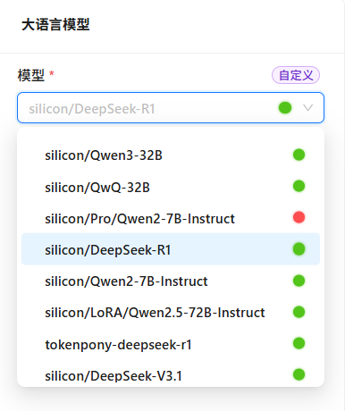

# 模型配置

在模型配置模块中，您可以接入各类AI模型，包括大语言模型、向量化模型和视觉语言模型。Nexent支持多种模型提供商，帮助您根据实际需求灵活选择最适合的模型。

## 🔄 同步ModelEngine模型

Nexent即将支持与ModelEngine平台的无缝对接，届时可自动同步并使用您在ModelEngine上部署的所有模型，敬请期待！

## 🛠️ 添加自定义模型

### 添加单个模型

1. **添加自定义模型**
   - 点击"添加自定义模型"按钮，进入添加模型弹窗。
2. **选择模型类型**
   - 点击模型类型下拉框，选择要添加的模型类型（大语言模型/向量化模型/视觉语言模型）。
3. **配置模型参数**
   - **模型名称（必填）**：输入请求体中的模型名称。
   - **展示名称**：可为模型设置一个展示名称，默认与模型名称相同。
   - **模型URL（必填）**：输入模型提供商的API端点。
   - **API Key**：输入您的API密钥。
4. **连通性验证**
   - 点击"连通性验证"按钮，系统会发送测试请求并返回验证结果。
5. **保存模型**
   - 配置完成后，点击"确定"按钮，模型将被添加到可用模型列表中。

  

### 批量添加模型

为了提升模型导入效率，Nexent提供了批量模型导入功能。

1. **批量添加模型**
   - 在添加模型弹窗中，打开批量添加模型开关。
4. **选择模型提供商**
   - 点击模型提供商下拉框，选择模型提供商。
3. **选择模型类型**
   - 点击模型类型下拉框，选择要添加的模型类型（大语言模型/向量化模型/视觉语言模型）。
4. **输入API Key（必填）**
   - 输入您的API密钥。
5. **获取模型**
   - 点击"获取模型"按钮，批量获取模型列表。
6. **选择模型**
   - 获取到的模型默认是未启用的，您需要手动点击开关启用所需的模型。
7. **保存模型**
   - 配置完成后，点击"确定"按钮，所有选中的模型将被添加到可用模型列表中。

  

## 🔧 修改自定义模型

当您需要修改模型配置或删除不再使用的模型时，可以通过以下步骤进行操作：

1. 点击"修改自定义模型"按钮。
2. 选择要修改或删除的模型类型（大语言模型/向量化模型/视觉语言模型）。
3. 选择是批量修改模型，还是修改单例自定义模型。
4. 如果批量修改模型，可以通过启动或关闭模型开关，添加或删除模型。您可以通过点击右上角的"修改配置"按钮，对选中的模型进行批量的配置修改。
5. 如果是修改单例自定义模型，点击删除按钮 🗑️ ，即可删除目标模型；想要修改相关配置，点击模型名称，即可弹出修改弹窗进行修改。

  
  

 

  
  

 

  
  

## ⚙️ 配置系统模型

添加模型后，您需要配置系统基础模型，该模型将用于标题生成、实时文件读取等基础功能。在智能体运行时，您可以为每个智能体指定特定的运行模型。

### 基础模型配置
系统基础模型用于处理平台的核心功能，包括：
- 标题生成
- 实时文件读取
- 基础文本处理

**配置步骤**：
- 点击基础模型下拉框，从已添加的大语言模型中选择一个作为系统基础模型。

### 向量化模型
向量化模型主要用于知识库的文本、图片等数据的向量化处理，是实现高效检索和语义理解的基础。配置合适的向量化模型，可以显著提升知识库的搜索准确率和多模态数据的处理能力。
- 点击向量模型下拉框，从已添加的向量化模型中选择一个。

### 多模态模型
多模态模型结合了视觉和语言能力，能够处理包含文本、图片等多种信息的复杂场景。例如，在对话页面上传图片文件时，系统会自动调用多模态模型进行内容解析和智能对话。
- 点击视觉语言模型下拉框，从已添加的视觉语言模型中选择一个。

  
  
  

## ✅ 检查模型连通性

定期检查模型连通性是确保系统稳定运行的重要环节。通过连通性检查功能，您可以及时发现和解决模型连接问题，保证服务的连续性和可靠性。

**检查流程**：
- 点击"检查模型连通性"按钮
- 系统将自动测试所有已配置的系统模型的连接状态

**状态指示**：
- 🔵 **蓝色圆点**：表示正在检测中，请耐心等待
- 🔴 **红色圆点**：表示连接失败，需要检查配置或网络状态
- 🟢 **绿色圆点**：表示连接正常，模型可以正常使用

**故障排查建议**：
- 检查网络连接是否稳定
- 验证API密钥是否有效且未过期
- 确认模型服务商的服务状态
- 检查防火墙和安全策略设置

## 🤖 支持的模型提供商

### 🤖 大语言模型LLM
Nexent 支持任何 **遵循OpenAI API规范** 的大语言模型供应商，包括：
- [硅基流动](https://siliconflow.cn/)
- [阿里云百炼](https://bailian.console.aliyun.com/)
- [小马算力](https://www.tokenpony.cn/)
- [Deepseek](https://platform.deepseek.com/)
- [OpenAI](https://platform.openai.com/)
- [Anthropic](https://console.anthropic.com/)
- [月之暗面](https://platform.moonshot.cn/)

可参考以下步骤进行模型接入：
1. 访问模型供应商官网，注册账户；
2. 创建并复制API Key；
3. 在文档中查看API端点（即模型URL，一般以`/v1`为结尾）；
4. 在Nexent模型配置页面点击添加自定义模型，填入必备信息，即可接入。

### 🎭 多模态视觉模型

使用与大语言模型相同的API Key和模型URL，但指定多模态模型名称，如硅基流动提供的**Qwen/Qwen2.5-VL-32B-Instruct**。

### 🔤 向量模型

使用与大语言模型相同的API Key，但模型URL一般会有所差异，一般以`/v1/embeddings`为结尾，同时指定向量模型名称，如硅基流动提供的**BAAI/bge-m3**。

### 🎤 语音模型

目前仅支持火山引擎语音，且需要在`.env`中进行配置
- **网站**: [volcengine.com/product/voice-tech](https://www.volcengine.com/product/voice-tech)
- **免费额度**: 个人使用可用
- **特色**: 高质量中英文语音合成

**开始使用**:
1. 注册火山引擎账户
2. 访问语音技术服务
3. 创建应用并获取 API Key
4. 在环境中配置 TTS/STT 设置

## 💡 需要帮助

如果您在模型提供商方面遇到问题：
1. 查看提供商特定文档
2. 验证 API 密钥权限和配额
3. 使用提供商官方示例进行测试
4. 加入我们的 [Discord 社区](https://discord.gg/tb5H3S3wyv) 获取支持

## 🚀 下一步

完成模型配置后，建议您点击"下一步"按钮，继续配置：
1. **[知识库配置](./knowledge-base-configuration)** - 创建和管理知识库。
2. **[智能体配置](./agent-configuration)** - 创建和配置智能体。

如在模型配置过程中遇到任何问题，请参考我们的 **[常见问题](../getting-started/faq)** ，或加入我们的 [Discord社区](https://discord.gg/tb5H3S3wyv) 获取支持。 